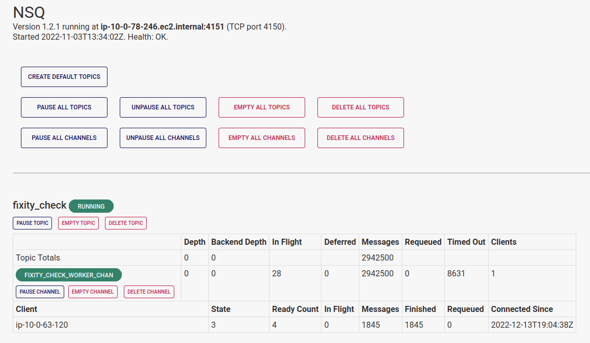

# NSQ

The Registry provides access to NSQ, so APTrust admins can see the status of queues and topics. We expose NSQ here, rather than on the public internet, so outsiders can't access its admin panel. (Hint: You'll find it in Registry's left sidebar, under **More Options > NSQ**.)

The NSQ admin panel shows you info about nsqd's basic health, including where it's running and how many workers are listening on each channel.

It also provides controls to pause, unpause, and empty individual topics and channels, or all topics and channels at once.

## Definitions

A **topic** receives tasks as inputs. For example, when Preserv's bucket reader finds new tar files in depositors' receiving buckets, it creates a WorkItem in Registry and adds the WorkItem ID to the `ingest01_prefetch` topic.

Workers listen on **channels**, through which nsqd pushes WorkItems to the listening workers. For example, Preserv's `ingest_pre_fetch` worker listens to the `ingest_pre_fetch_worker_chan`, where it picks up WorkItem IDs.

NSQ supports multiple channels per topic, because in many other environments, it's common for more than one worker to have to act on items in a given topic. In APTrust's system, we have only one channel per topic.

## Pausing and Unpausing Topics

Pausing topics and channels will cause NSQ to continue to queue new incoming tasks while preventing it from farming those tasks out to workers. Pausing topics and channels makes sense under the following circumstances:

* A worker has a known bug, and you want to stop it from touching data until you can deploy a fix.
* You need to run a database migration, and you want all processing to stop until the migration completes.
* You are replacing some piece of infrastructure and you want processing to stop until the new hardware/service is ready. (This was common in our old Exchange architecture and should happen rarely or never in Preserv.)

The NSQ admin page includes buttons to pause all topics and all channels to simplify this process.

!!! warning

    Once you have paused topics and channels, you need to check the NSQ admin panel periodically to ensure that **no items are in flight** in any of the paused queues. Until the in-flight count hits zero on all of the paused topics and queues, you must assume Preserv is still reading from and writing to Registry. Running database migrations is unsafe until all in-flight counts are zero.

When you've completed your disruptive work, you can unpause topics and queues, and Preserv will continue its work. If you paused multiple topics and queues, the easiest way to unpause them is to use the "Unpause All" buttons.

## Emptying Topics and Channels

With the exception of the fixity check topic, you shouldn't empty topics without a very good reason. If you do empty one, you will likely have to manually requeue everything that was in there through the WorkItem web UI. (Those items will appear as stalled in the last phase of processing, and they won't move again until you requeue them.)

It is always safe to empty the `fixity_check` topic, and this is likely the only topic you will have cause to empty. The `apt_queue_fixity` worker pumps about 2,500 items into the fixity topic every half hour. These will be the first 2,500 files it finds that have not had a fixity check in at least 90 days.

If any kind of outage prevents the fixity checker from doing its work, `apt_queue_fixity` will keep queuing the same 2,500 items every half hour. If a network outage or S3 service outage lasts for a few hours (this happens, but it's rare), the `fixity_check` channel may accumulate a backlog of tens of thousands of items--and they'll be the same items queued again and again.

When the fixity checker resumes its work, it will check with registry to ensure that each queued item really does still need a fixity check, and it will skip the check if it's no longer required.

In practice, this amounts to the fixity checker calculating fixity on 2,500 items, and then sending tens of thousands of requests to Registry asking if the next item still needs a check. Registry has to answer "No" tens of thousands of times, and this amounts to a mini denial of service attack.

When you run into this situation (again, it's rare), keep in mind that **it is always safe to empty the fixity_check topic.**

Whatever meaningful items were in that topic will be put back in the next time `apt_queue_fixity` runs.
