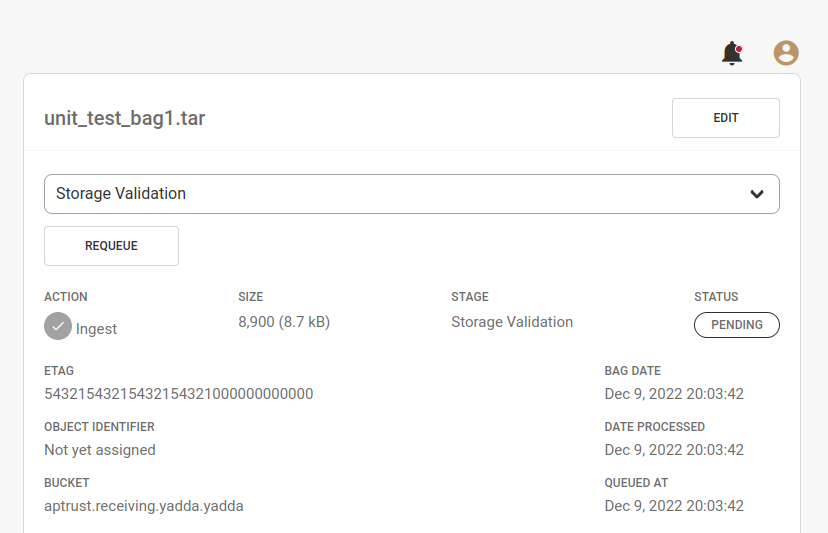

# Requeuing WorkItems

APTrust admins will see a button and a select list at the top of the WorkItem detail page _for items that have not completed processing._ There will be no requeue button for items that have finished ingest, restoration or deletion.

We typically have to requeue items only after something went wrong. The most common reasons for requeing are temporary network and external service outages. The WorkItem note will contain information about what went wrong during processing, and the `NeedsAdminReview` flag will be set to `true` and the `Retry` flag will be set to false.

In the requeue select list, Registry automatically pre-selects the stage where the item got stuck. Clicking the requeue button will clear the `NeedsAdminReview` flag, set `Retry` to true, change `Status` to `Pending`, and push the WorkItem ID back into the appropriate NSQ topic.

You can requeue an ingest item back to an earlier stage of processing, though there is generally no need to do that, and doing so may cause the ingest workers to repeat already-completed work.

!!! Warning

    If you requeue an ingest item back to the pre-fetch stage, you should delete the item's Redis data so the ingest workers will ignore any previously recorded errors.

Restoration and deletion items can also be requeued, though the need rarely arises.
